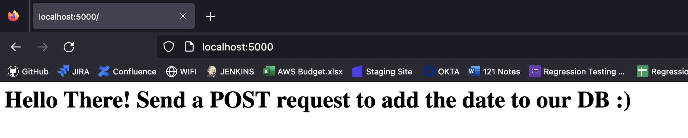
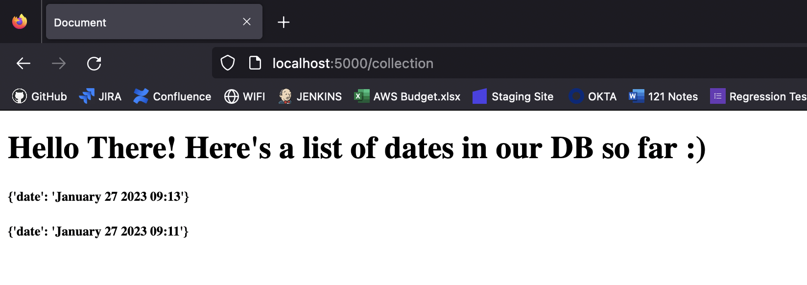

# Flask + Dynamo DB app deployed using Amazon ECS

### Pre-requisites to run this code 
### Terraform 
To run the infrastructure (terraform), you need the following
- [Terraform v1.2.X](https://developer.hashicorp.com/terraform/downloads) installed
- An AWS Account with [Access and Secret keys](https://aws.amazon.com/premiumsupport/knowledge-center/create-access-key/) set up 
- An S3 bucket in the account with the same name `farah-terraform-state-files`. Alternatively you can comment out this entire `backend` section in the `terraform.tf` file and TF will default to local state management. 

Save your AWS Keys in an `~/.aws/credentials` file (or wherever you keep your `.aws` directory), in the following format: 
```
[pollinate]
aws_access_key_id=<your-access-key>
aws_secret_access_key=<your-secret-key>
```
Here, `[rapha-prod]` indicates a *profile*. You need to switch to this profile using the following command. **Note**: this will not be persisted across terminal sessions. 
```bash
export AWS_PROFILE=pollinate
```
From this point on, terraform will automatically interact with AWS using these credentials. 

You can build out the associated infrastructure by running 
```terraform
terraform init
terraform plan 
terraform apply
```

### Python 
To run the API locally:
- Python3 installed
- a Dynamodb table with a name which matches `dateTable` and key `date`
- Clone the repository and run the following commands in your terminal:
```bash
python3 -m venv venv
source venv/bin/activate
pip install -r requirements.txt
python start.py
```
You should see the following message in the terminal, and if you click on the link the following page will appear. 

```
❯ python start.py
 * Serving Flask app 'app'
 * Debug mode: on
WARNING: This is a development server. Do not use it in a production deployment. Use a production WSGI server instead.
 * Running on all addresses (0.0.0.0)
 * Running on http://127.0.0.1:5000
 * Running on http://192.168.1.96:5000
Press CTRL+C to quit
 * Restarting with stat
 * Debugger is active!
 * Debugger PIN: 111-313-972
 ```

If you sent a post request to this URL, we can see it was successful
```
❯ curl -X POST localhost:5000
<h1 style='color:black'>Hello There! Send a POST request to add the date to our DB :)</h1>%  
```
```
127.0.0.1 - - [27/Jan/2023 09:11:48] "POST / HTTP/1.1" 200 -
```
And if we head to the `/collection` page we can see a list of dates in the db. 




### Docker 
To containerise this application, I used docker. 
- Install [Docker](https://docs.docker.com/get-docker/) 
  
I used the following commands to build an image, run it locally to check that the containerised app works, and push the image to Amazon ECR

```bash

docker build -t project:latest .
docker run -d -p 5000:5000 --name project project
docker images #to see the image id

docker tag 85c0e9540144 <your-aws-account-id>.dkr.ecr.eu-west-1.amazonaws.com/pollinate:test
docker push <your-aws-account-id>.dkr.ecr.eu-west-1.amazonaws.com/pollinate:latest
```

### Infrastructure
Unfortunately there were some issues with the docker container running on ECS, specifically "python exec error". Despite enabling logging I have been unable to debug it so far. I also tried running a very simple "hello world" Flask deployment to debug, and still ran into the issue. I suspect it's got something to do with the image. Regardless, I will walk through the infrastructure here. 

The Terraform code creates:
- A VPC with 3 public and 3 private subnets
- IGW and route tables
- NAT gateways so that the private subnets can access the internet (for patching)
- an ECS cluster with scaling policies 
- an ESC service and task_definition for the docker container created earlier
- iam roles for the ecs, ec2 and dynamodb resources to manage access 
- a public facing load balancer for the service
- a dynamodb with name `dateTable` to match the app requirements. 
- Cloudwatch logs and alarms for the service


